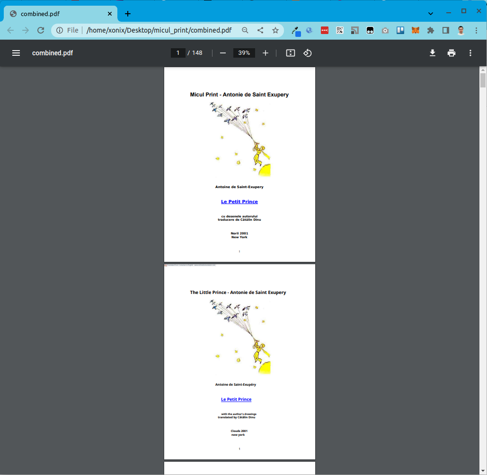
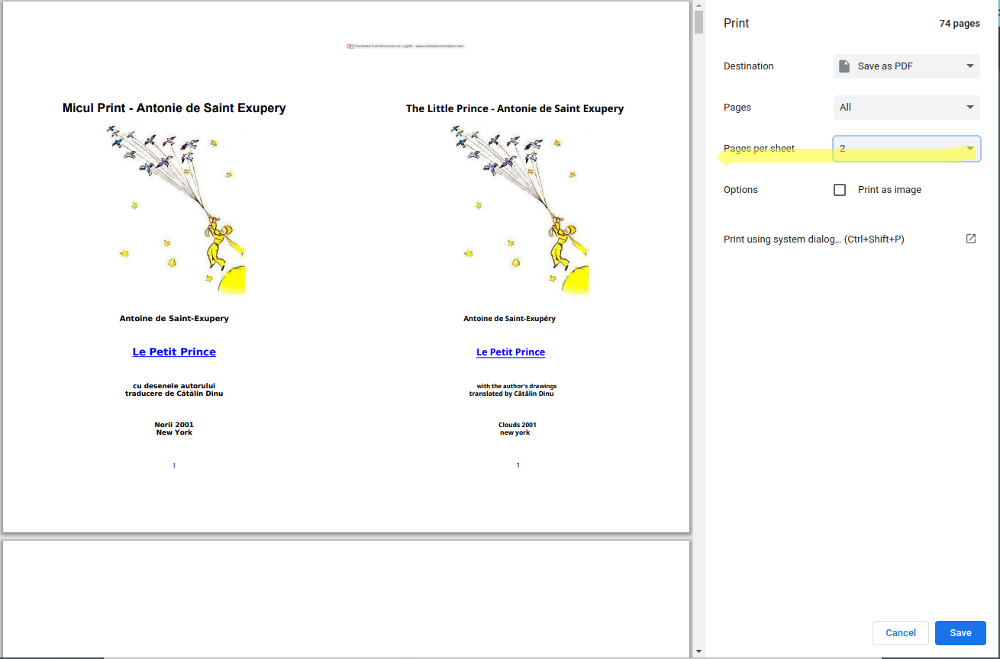
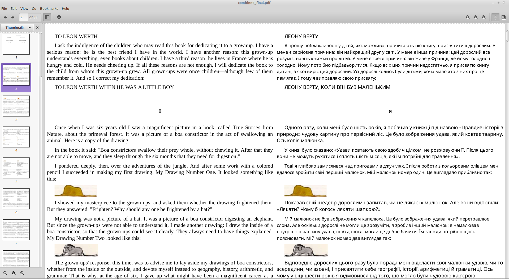

# Create bilingual books yourself

_February 2023_

Bilingual books are incredibly useful for language learners. 

I'll outline a simple process for creating your own bilingual books. 

### 1. Obtain the PDF

First, buy online or find a PDF of the book you want to turn into a bilingual. _It must be in a language you're learning._  

### 2. Translate the PDF

Next, you'll need to translate the text of the source PDF into the language you know. 

As complex as it sounds, as easy it is. I used the free online service [https://www.onlinedoctranslator.com/en/translationform](https://www.onlinedoctranslator.com/en/translationform). Simply upload the source PDF and receive a translated version (Google Translate is used). Of course, you can also just use [Google Translate for documents](https://translate.google.com/?op=docs) with the same result.  

For those who object to using Google Translate here. It's true that automatic translations aren't always perfect. But for our task it's not a big deal. We use authentic source text, and it's fine to use less perfect translation. Besides, automatic translations have improved significantly in recent years.

### 3. Merge the source & translated PDFs

This step is a bit tricky and technical. You need to merge the two PDFs, but in a specific way. 

You need to build a merged PDF where the source and translated PDF pages go interleaved. That is: 1st page source, 1st page translated, 2nd page source, 2nd page translated, and so on.

I used a pdftk tool for that 

```
sudo apt install pdftk
```

and came up with a small automation script to do the job: [prepare_joined.awk](https://github.com/xonixx/bilingual_books/blob/main/prepare_joined.awk).

Just run
```
awk -f prepare_joined.awk source.pdf translated.pdf 
```

You'll get `combined.pdf` as a result.



### 4. Generate the final bilingual book PDF
                                        
To do so just open the combined PDF in Google Chrome and hit Print.

The key point here is to use <ins>Pages per sheet: 2</ins> setting.



### 5. Profit!
  
Now you can just print the final PDF on paper or put it to your Kindle. Enjoy your bilingual book!

