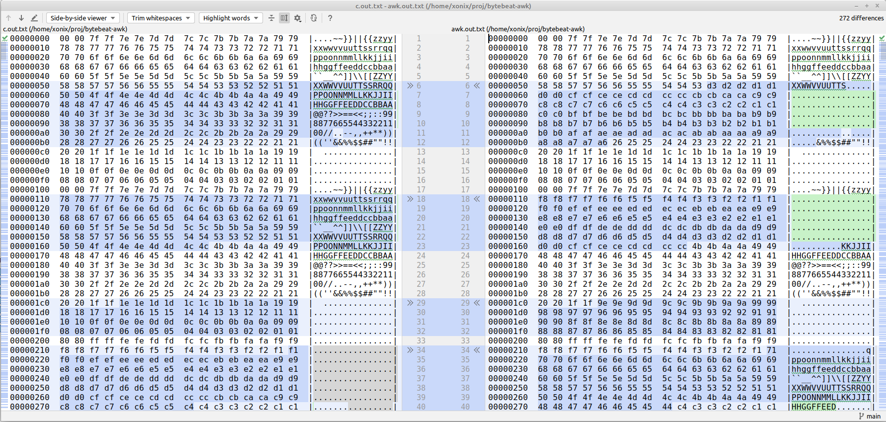

# Bytebeat with Gawk

_April 2023_

Not long ago I came across this link http://kmkeen.com/awk-music/. The blog post describes a simple awk script that is able to generate harmonious audio sounds. 

I immediately recalled the [bytebeat](http://countercomplex.blogspot.com/2011/10/algorithmic-symphonies-from-one-line-of.html) -- a technique of generating interesting sound effects and even the whole melodies in couple lines of C code.

I thought -- would it be possible (just for fun, of course) to convert some of bytebeats from C to GAWK? 

Why AWK? Because [I'm a huge fan of it](awk.md). Why particularly GNU AWK? Because only GNU AWK variant has built-in [bitwise functions](https://www.gnu.org/software/gawk/manual/html_node/Bitwise-Functions.html).

Here is the result of my effort (link to YouTube, please turn down the volume a bit before you click, just in case):

[](https://www.youtube.com/watch?v=qOenoyBO7XY)

Below I would like to share some of the learnings I have gained along the way.

***            

The idea of bytebeat is pretty simple. It exploits the old Unix principle that [everything is a file](https://en.wikipedia.org/wiki/Everything_is_a_file). So generating music this way is as easy as running:

```
./prog > /dev/dsp
```

Where `./prog` is a (compiled C, for example) program, that outputs stream of bytes, and `/dev/dsp` is a "virtual file" representing the audio input device.

Unfortunately, modern Linuxes don't expose audio devices in form of a file. 

However, nowadays, you have plenty of ways to achieve the similar result. For example, in Linux you have `aplay` command -- "command-line sound player for ALSA soundcard driver". So, the same command looks like

```
./prog | aplay
```

***

Let's take a look at a simple bytebeat:

```c
// file: a1.c
main(t) {
for(t=0;;t++)putchar(
    t*((t>>12|t>>8)&63&t>>4) // <-- formula that defines the melody
);}
```

Now, to make it play you need:
```
$ cc -w a1.c -o a1
$ ./a1 | aplay -f u8
Playing raw data 'stdin' : Unsigned 8 bit, Rate 8000 Hz, Mono
```

The conversion to GAWK (using the [bitwise functions](https://www.gnu.org/software/gawk/manual/html_node/Bitwise-Functions.html)) is pretty straightforward:
```awk
# file: a1.awk
BEGIN { for(;;t++)
  printf"%c",t*and(or(rshift(t,12),rshift(t,8)),63,rshift(t,4))
}
```

However, running it, you can immediately notice, that the sound it produces is not the same as of the C source:
```
$ gawk -f a1.awk | aplay -f u8
Playing raw data 'stdin' : Unsigned 8 bit, Rate 8000 Hz, Mono
```

What's the problem?
                        
Obviously, the GAWK variant generates different stream of bytes than the C.

Not understanding what's going on, I decided to start from the simplest formula possible: `t`. I also decided to generate a fixed number of bytes (`10000`) by both programs and try to compare the outputs.

```c
// file tmp.c
main(t) {
for(t=0;t<10000;t++)putchar(
    t
);}
```
```awk
# file: tmp.awk
BEGIN { for(;t<10000;t++)
  printf"%c",t
}
```
 
Generating outputs:
```
$ cc -w tmp.c -o tmp
$ ./tmp > tmp.c.out
$ gawk -f tmp.awk > tmp.awk.out
```

The first obvious thing -- let's check the length of both files:
```
$ ls -l tmp.*.out
-rw-rw-r-- 1 xonix xonix 27824 Apr 18 20:07 tmp.awk.out
-rw-rw-r-- 1 xonix xonix 10000 Apr 18 20:07 tmp.c.out
```

Here is it! The C output is 10000 bytes long as expected, but GAWK generates a longer file.

Let's look at [putchar](https://en.cppreference.com/w/c/io/putchar) C standard function. According to the documentation, it writes a character (represented by `int`) to stdout by converting it to `unsigned char` just before being written. If we take a closer look at [C standard types](https://learn.microsoft.com/en-us/cpp/cpp/data-type-ranges?view=msvc-170) we find that `int` is (signed) 4 bytes long, and `unsigned char` is unsigned 1 byte long.

So, eventually, what `putchar` does is it takes the `int` argument and only uses the lowest byte of it. The rest of the argument value is just discarded.

Let's make a small experiment.

C:
```
$ echo 'main(){putchar(9786);}' | tcc -w -run -
:
```
(here I use [tcc](https://bellard.org/tcc/) by genius Fabrice Bellard for convenience).
  
GAWK:
```
$ gawk 'BEGIN { printf"%c",9786 }'
☺
```

Long story short, it appears that GAWK by default operates on unicode characters, not bytes. But it has [`-b` option](https://www.gnu.org/software/gawk/manual/html_node/Options.html#index-_002db-option) that allows to work with strings as with single-byte characters.

```
$ gawk -b 'BEGIN { printf"%c\n",9786 }'       # now the output matches C!
:
$ gawk -b -f tmp.awk > tmp.awk.out
$ ls -l tmp.*.out
-rw-rw-r-- 1 xonix xonix 10000 Apr 18 21:33 tmp.awk.out
-rw-rw-r-- 1 xonix xonix 10000 Apr 18 20:07 tmp.c.out
```

Excellent! Now the sound plays as intended:

```
$ gawk -b -f a1.awk | aplay -f u8
Playing raw data 'stdin' : Unsigned 8 bit, Rate 8000 Hz, Mono
```
     
***

Using the same conversion technique I was able to convert a couple more bytebeats from C to GAWK. If you are on Linux, you can try each of them straight in the command line:   

```
gawk -b 'BEGIN { for(;;t++)printf"%c",t*and(or(rshift(t,12),rshift(t,8)),63,rshift(t,4)) }' | aplay -f u8

gawk -b 'BEGIN { for(;;t++)printf"%c",and(t,t%255)-and(t*3,rshift(t,13),rshift(t,6)) }' | aplay -f u8

gawk -b 'BEGIN { for(;;t++)printf"%c",or(and(t*5,rshift(t,7)),and(t*3,rshift(t*4,10))) }' | aplay -f u8

gawk -b 'BEGIN { for(;;t++)printf"%c",or(t,or(rshift(t,9),rshift(t,7)))*and(t,or(rshift(t,11),rshift(t,9)))}' | aplay -f u8
```

During the conversion it was crucial to understand the [operators precedence in C](http://www.eecs.northwestern.edu/~wkliao/op-prec.htm). Without paying close attention to this you risk to put `()` in wrong order, not equivalent to the logic of the C source.

***

Finally, I wanted to try something more complex. I chose [this bytebeat by ryg](https://www.youtube.com/watch?v=tCRPUv8V22o&t=176s) that resembles a melody:

```c
main(t) {
for(;;t++)putchar(
((t*("36364689"[t>>13&7]&15))/12&128)
+(((((t>>12)^(t>>12)-2)%11*t)/4|t>>13)&127)
);}
```

This is where GAWK started to fail miserably. The reason for this was that C allows binary operations on negative numbers. After all, it's a binary representation of a number that matters, so you are allowed to do it, provided that you understand what you are doing. However, GAWK [chose to explicitly disallow](https://www.gnu.org/software/gawk/manual/html_node/Bitwise-Functions.html#index-sidebar-22). It appears, the bytebeat above uses heavily binary operation on negatives ☹.

Let me show you the problem.

C:
```
$ echo
'main(){printf("%d\n",5^2);printf("%d\n",-5^2);printf("%d\n",5^-2);printf("%d\n",-5^-2);}'
| tcc -w -run -
7
-7
-5
5
```

JavaScript (node + browsers):
```
$ node -e
'console.log(5^2);console.log(-5^2);console.log(5^-2);console.log(-5^-2);'
7
-7
-5
5
```

Python:
```
$ python3 -c 'print(5^2);print(-5^2);print(5^-2);print(-5^-2)'
7
-7
-5
5
```

Gawk:
```
$ gawk 'BEGIN { print xor(5,2);print xor(-5,2);print xor(5,-2);print xor(-5,-2); }'
7
gawk: cmd. line:1: fatal: xor: argument 2 negative value -5 is not allowed
```

***

I wondered -- is it possible to emulate in GAWK the bitwise logic on negative numbers according to C and other languages?

I knew that GAWK internally works with numbers using (64 bits) double-precision floating points (`double` in C). If we take a look at a [binary representation of doubles](https://en.wikipedia.org/wiki/Double-precision_floating-point_format#IEEE_754_double-precision_binary_floating-point_format:_binary64) we'll find that they use 53 bits of precision which is far more than 32 bits needed to represent `int`. So it should be absolutely possible to emulate binary operations on (signed) `int`-s on top of `double` representation.

First step here is to understand how signed (or, particularly, negative) integers are represented in binary form. It turns out, the [Two's complement](https://en.wikipedia.org/wiki/Two%27s_complement) mechanism is the key here. 

This gives a clue to a possible solution. We need to convert a GAWK number (`decimal`) into some other (positive) `decimal` representation that will "play a role" of (signed) `int`, eligible for GAWK binary functions. We will also need the reverse conversion to convert "`int`-like" `decimal`-s back to "ordinary" `decimal`-s.

This is exactly [how I coded it](https://github.com/xonixx/bytebeat-gawk/blob/main/bitint.awk) (functions `toint` and `fromint`) according to the Two's complement algorithm mentioned above. Luckily GAWK provides the `compl()` function, needed for bitwise complement, making the solution possible.

Overall, I would prefer if GAWK used the approach taken by JavaScript:

> JavaScript stores numbers as 64 bits floating point numbers, but all bitwise operations are performed on 32 bits binary numbers. Before a bitwise operation is performed, JavaScript converts numbers to 32
bits signed integers. After the bitwise operation is performed, the result is converted back to 64 bits JavaScript numbers.

***

I also want to mention some other techniques I've used for debugging the converted result in attempt to make it produce the same output (and therefore the sound) as the source.

I used the same technique of generating the fixed count of bytes and comparing the outputs from the source and the converted bytebeats. To localize the problem I debugged the output on smaller parts of the formula, making it converge piece-by-piece. That is, instead of trying to fight the whole formula `((t*("36364689"[t>>13&7]&15))/12&128)+(((((t>>12)^(t>>12)-2)%11*t)/4|t>>13)&127)` I took just `t>>13&7` and made it convert correctly, then `"36364689"[t>>13&7]`, and so on.

It's not easy to compare binary outputs directly, so I used the `hexdump` utility to turn binary into human-readable text. Afterward I've used file comparison in my IDE to spot the difference:



For this purpose I've used the small script to generate the files:

```shell
set -e

X=a3

tcc -w -run $X.c > c.out||true ; hexdump -C c.out   > c.out.txt
gawk -f $X.awk -b > awk.out    ; hexdump -C awk.out > awk.out.txt
```

The other learning was that I needed to add `-C` flag to `hexdump`, [otherwise](https://unix.stackexchange.com/a/55772/52083) due to endiannes inconsistency it was swapping the bytes in the text output.   
       
***

Also, it was interesting to measure the generation speed of C vs GAWK. For this purpose I've used the `pv` utility: 

```
$ ./a3 | pv > /dev/null
 874MiB 0:00:14 [61.6MiB/s]
 
$ gawk -f a3final.awk -b | pv >/dev/null
5.94MiB 0:00:21 [ 293KiB/s] 
```

So according to this C is roughly **210** times faster than GAWK ¯\_(ツ)_/¯

Let's check what speed is enough for playback:

```
$ ./a3 | pv | aplay -f u8 -r 44100
Playing raw data 'stdin' : Unsigned 8 bit, Rate 44100 Hz, Mono
 784KiB 0:00:16 [46.5KiB/s]                  
```

So GAWK still has **6x** margin. 

## Conclusion

All in all, it was a pretty amusing adventure. 

I learned some interesting details on binary arithmetic and how it's done under the hood of the computer.

I can't but recommend this exercise to other programmers. Try converting some bytebeats from C to your favorite programming language. Probably, you'll like it as much as I did! 