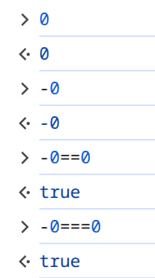
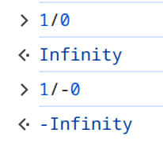
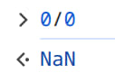
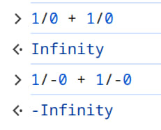
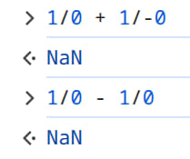
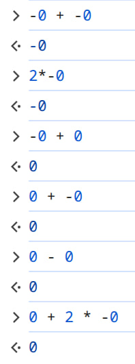
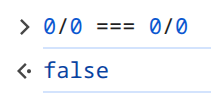
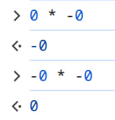

# Fun with floats

_July 2026_ No LLM was used to write this article

Did you know that floating-point numbers ([IEEE 754](https://en.wikipedia.org/wiki/IEEE_754)) have `0` and `-0`?

Looks like nothing spacial. They are just equal. 
                        
But there is a nuance.

Further more.

Not a number!

Let's try to add infinities

Infinities are infinities, no matter how many you add them up.

Let's try to subtract.

Well, this is very logical, isn't it?

In this regard it is not so logical that infinities are considered to be equal.

It's worth mentioning that `NaN` is the only float that doesn't equal to itself.

Let's continue. Let's consider arithmetics of zeros.

Conclusion: positive zero beats negative.

But not always

