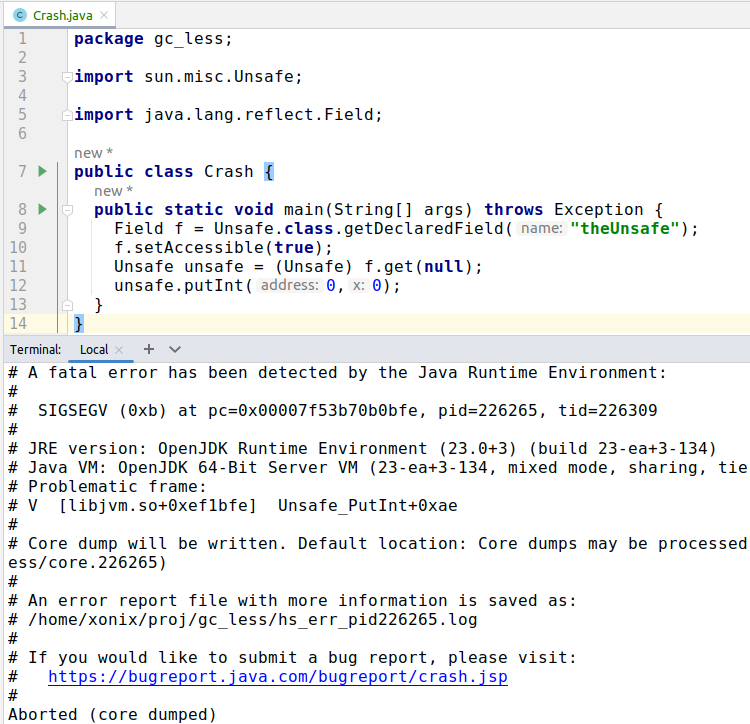
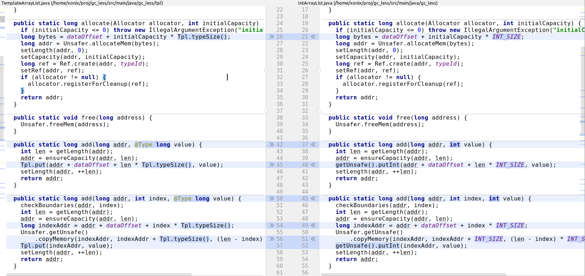

# GC-less (heap-less) Java

_TODO 2024_

## What

https://github.com/xonixx/gc_less - Experiments TODO

## Why

For fun and curiosity. 

Basically I wanted to check if the famous `sun.misc.Unsafe` approach is still viable with latest Java. 

Also, I wanted to try to program in Java like if I program in C and see how it goes.

## How
    
### sun.misc.Unsafe

`sun.misc.Unsafe` class is unsafe indeed. You can easily crash your JVM with just a couple lines of code:

Yet it still it appears to be [pretty widely used](https://github.com/search?q=getDeclaredField%28%22theUnsafe%22%29&type=code). 

### Epsilon GC

To make sure that we indeed do not (accidentally) consume heap I enabled [the Epsilon GC setting](https://github.com/xonixx/gc_less/blob/7c6730eff1ec22c91f66826114de7943416771ad/Makesurefile#L34).

[Epsilon GC](https://openjdk.org/jeps/318) is "a GC that handles memory allocation but does not implement any actual memory reclamation mechanism. Once the available Java heap is exhausted, the JVM will shut down."

### Data structures implementation

### Generating code by template

Instead of writing separate implementations for each Java type (int, long, double, etc.) I decided to generate them by templates.

This way from a single template (for example, [TemplateArrayList.java](https://github.com/xonixx/gc_less/blob/8fa1fa5858b85ad794c85cf284ffbbbfac3af975/src/main/java/gc_less/tpl/TemplateArrayList.java)) the set on specialized implementations are generated:

- [IntArrayList.java](https://github.com/xonixx/gc_less/blob/8fa1fa5858b85ad794c85cf284ffbbbfac3af975/src/main/java/gc_less/IntArrayList.java)
- [LongArrayList.java](https://github.com/xonixx/gc_less/blob/8fa1fa5858b85ad794c85cf284ffbbbfac3af975/src/main/java/gc_less/LongArrayList.java)
- [DoubleArrayList.java](https://github.com/xonixx/gc_less/blob/8fa1fa5858b85ad794c85cf284ffbbbfac3af975/src/main/java/gc_less/DoubleArrayList.java)

Interesting to note is that the template itself is a runnable code as well, in fact implementation-wise it corresponds to `long`-specialized version.
This is convenient, because we can [test a template](https://github.com/xonixx/gc_less/blob/8fa1fa5858b85ad794c85cf284ffbbbfac3af975/src/test/java/gc_less/tpl/TemplateArrayListTests.java) and this makes sure all the specialized implementations are correct too.

The generation is implemented in form of a script [gen.awk](https://github.com/xonixx/gc_less/blob/8fa1fa5858b85ad794c85cf284ffbbbfac3af975/gen.awk) ([Why AWK?](awk.md)).

We use annotation [@Type](https://github.com/xonixx/gc_less/blob/8fa1fa5858b85ad794c85cf284ffbbbfac3af975/src/main/java/gc_less/tpl/Type.java) and class [Tpl](https://github.com/xonixx/gc_less/blob/8fa1fa5858b85ad794c85cf284ffbbbfac3af975/src/main/java/gc_less/tpl/Tpl.java) to denote patterns to be replaced by a generator:

### Allocator + try-with-resources

### Ref

### Memory leaks detection

I had an idea to implement memory leaks detection. This appeared [relatively easy to achieve](https://github.com/xonixx/gc_less/blob/3615ee7a490cc353ff7eb7c5a12221a94ed49ebb/src/main/java/gc_less/Unsafer.java#L30). The idea: on each memory allocation we remember the place (we instantiate `new Exception()` to capture a stack trace). On each corresponding memory `free()` we discard it.
Thus, at the end we check what's left.

I implemented a [base test class](https://github.com/xonixx/gc_less/blob/3615ee7a490cc353ff7eb7c5a12221a94ed49ebb/src/test/java/gc_less/MemoryTrackingBase.java) such that test that extend it can automatically ensure the absence of memory leaks.
       
### Using `java.lang.foreign.MemorySegment` 

https://openjdk.org/jeps/8323072

https://openjdk.org/jeps/454#Linking-Java-code-to-foreign-functions

### Python-like hashtable implementation

https://www.fluentpython.com/extra/internals-of-sets-and-dicts/

### Benchmark

