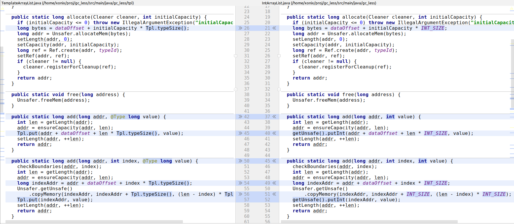

# GC-less (heap-less) Java

_TODO 2024_

## What

https://github.com/xonixx/gc_less - in this repository I did a series of experiments in GC-less (heap-less) Java using `sun.misc.Unsafe` and also the newest alternative `java.lang.foreign.MemorySegment`.

GC-less (heap-less) means we allocate data structures in native memory directly (outside JVM heap). Such structures are not visible to GC. But this means that we are responsible for their (explicit) de-allocations (i.e., manual memory management).                       

## Why

For fun and out of curiosity. 

Basically it started when I wanted to check if the famous `sun.misc.Unsafe` approach is still viable with the latest Java. 

Also, I wanted to try to program in Java like if I program in C and see how it goes.

## How
    
### sun.misc.Unsafe
                   
It was a surprise to find that this class is still supported by the latest (at the time of this writing) Java version 23.

`sun.misc.Unsafe` class is unsafe indeed. You can easily crash your JVM with just a couple lines of code:


Yet still it appears to be [pretty widely used](https://github.com/search?q=getDeclaredField%28%22theUnsafe%22%29&type=code). 
 
Anyway, of interest to us is a [family of methods in this class, related to off-heap memory management](https://blog.vanillajava.blog/2014/01/sunmiscunsafe-and-off-heap-memory.html).

### Data structures implementation

So as a practical application of GC-less (heap-less) style of programming I decided to implement some basic data structures:

- array
- array list
- stack
- hash map
       
Not only was I interested in how easy it is or if it's feasible at all. I also wondered how the performance will compare to plain Java's data structures.

### Generating code by template

Instead of writing separate implementations for each Java type (int, long, double, etc.) I decided to generate them by templates.

This way from a single template (for example, [TemplateArrayList.java](https://github.com/xonixx/gc_less/blob/8fa1fa5858b85ad794c85cf284ffbbbfac3af975/src/main/java/gc_less/tpl/TemplateArrayList.java)) the set on specialized implementations are generated:

- [IntArrayList.java](https://github.com/xonixx/gc_less/blob/8fa1fa5858b85ad794c85cf284ffbbbfac3af975/src/main/java/gc_less/IntArrayList.java)
- [LongArrayList.java](https://github.com/xonixx/gc_less/blob/8fa1fa5858b85ad794c85cf284ffbbbfac3af975/src/main/java/gc_less/LongArrayList.java)
- [DoubleArrayList.java](https://github.com/xonixx/gc_less/blob/8fa1fa5858b85ad794c85cf284ffbbbfac3af975/src/main/java/gc_less/DoubleArrayList.java)

Interesting to note is that the template itself is a runnable code. In fact implementation-wise it corresponds to `long`-specialized version.
This is convenient, because we can [test a template](https://github.com/xonixx/gc_less/blob/8fa1fa5858b85ad794c85cf284ffbbbfac3af975/src/test/java/gc_less/tpl/TemplateArrayListTests.java) and this makes sure all the specialized implementations are correct too.

The generation is implemented in form of a script [gen.awk](https://github.com/xonixx/gc_less/blob/8fa1fa5858b85ad794c85cf284ffbbbfac3af975/gen.awk) ([Why AWK?](awk.md)).

We use annotation [@Type](https://github.com/xonixx/gc_less/blob/8fa1fa5858b85ad794c85cf284ffbbbfac3af975/src/main/java/gc_less/tpl/Type.java) and class [Tpl](https://github.com/xonixx/gc_less/blob/8fa1fa5858b85ad794c85cf284ffbbbfac3af975/src/main/java/gc_less/tpl/Tpl.java) to denote patterns to be replaced by a generator:



### Epsilon GC

To make sure that we indeed do not (accidentally) consume heap I enabled [the Epsilon GC setting](https://github.com/xonixx/gc_less/blob/7c6730eff1ec22c91f66826114de7943416771ad/Makesurefile#L34).

[Epsilon GC](https://openjdk.org/jeps/318) is "a GC that handles memory allocation but does not implement any actual memory reclamation mechanism. Once the available Java heap is exhausted, the JVM will shut down."
   
### Some implementation details

I implemented the data structures in a slightly "strange" OOP-resembling way.

So, for example, take a look at [IntArrayList](https://github.com/xonixx/gc_less/blob/main/src/main/java/gc_less/IntArrayList.java). 

All the methods of this class are static, because we don't want to allocate object on heap. 

Also, all the methods (except for `allocate`, which plays a role of the constructor) accept `long address` as first parameter. It plays a role of `this` (in a sense, it is somehow analogous to Python's `self` parameter). 

So the usage looks like:

```java
    long address = IntArray.allocate(cleaner,10);
    IntArray.set(address, 7, 222);
    System.out.println(IntArray.get(address, 7));
```

So this `long address` plays a role of a reference. Obviously, with this you can't have inheritance / overriding, but we don't need it.

#### try-with-resources + `Cleaner` and `Ref` classes

The idea of the [Cleaner](https://github.com/xonixx/gc_less/blob/92b526a2eb4c82a44b32623171c3727b04a03ed9/src/main/java/gc_less/Cleaner.java) class is you pass the instance of it in the allocation procedure of a (GC-less) class, such that the `Cleaner` becomes responsible for free-ing the memory of the allocated instance. This plays best with try-with-resources.

```java
    try (Cleaner cleaner = new Cleaner()) {
      long array = IntArray.allocate(cleaner,10);
      IntArray.set(array,1,1);
      long map = IntHashtable.allocate(cleaner,10,.75f);
      IntHashtable.put(map,1,1);
      System.out.println(IntArray.getLength(array));
      System.out.println(IntHashtable.getSize(map));
    }
    // both array and map above are de-allocated, memory reclaimed
```

[Ref](https://github.com/xonixx/gc_less/blob/92b526a2eb4c82a44b32623171c3727b04a03ed9/src/main/java/gc_less/Ref.java) class is needed when we want to register some object for cleanup. But we can't simply register its address, because the object can be relocated due to memory reallocation due to growing. So it means, the GC-less object registers for cleanup by `Cleaner` [via the `Ref`](https://github.com/xonixx/gc_less/blob/92b526a2eb4c82a44b32623171c3727b04a03ed9/src/main/java/gc_less/IntArrayList.java#L28) and then the `Ref` pointer gets updated [on each object relocation](https://github.com/xonixx/gc_less/blob/92b526a2eb4c82a44b32623171c3727b04a03ed9/src/main/java/gc_less/IntArrayList.java#L72). 


### Memory leaks detection

I had an idea to implement memory leaks detection. This appeared [relatively easy to achieve](https://github.com/xonixx/gc_less/blob/3615ee7a490cc353ff7eb7c5a12221a94ed49ebb/src/main/java/gc_less/Unsafer.java#L30). The idea: on each memory allocation we remember the place (we instantiate `new Exception()` to capture a stack trace). On each corresponding memory `free()` we discard it.
Thus, at the end we check what's left.

I implemented a [base test class](https://github.com/xonixx/gc_less/blob/3615ee7a490cc353ff7eb7c5a12221a94ed49ebb/src/test/java/gc_less/MemoryTrackingBase.java) such that test that extend it can automatically ensure the absence of memory leaks.
       
### Using `java.lang.foreign.MemorySegment`

It appears, that very recently this JEP emerged: ["Deprecate Memory-Access Methods in sun.misc.Unsafe for Removal"](https://openjdk.org/jeps/8323072).

This means that despite using memory-access methods in `sun.misc.Unsafe` is fun and sometimes useful, we can no longer rely on this functionality. 

The JEP happens to provide the safer alternatives. I decided to take a deeper look at the updated API and understand how it compares to now deprecated `sun.misc.Unsafe`.

Overall I found that the new API provides a "managed" API over the native memory. That is, when previously we accessed memory via `long` that represented the raw memory address, now we have `java.lang.foreign.MemorySegment` object (that represents both a _pointer_ and a _memory region_). Obviously this is good and bad.

Good, as using a dedicated get/set methods from that class gives much safer guarantees, like, for example, built-in out-of-bounds access checks, control of accessing properly aligned memory, etc.

Bad, as it's much heavier. So now, for every off-heap allocation we need to have an on-heap handler in the form of `MemorySegment` instance. To me this renders the idea of using the algorithms with lots of small allocations non-viable.  


https://openjdk.org/jeps/454#Linking-Java-code-to-foreign-functions

### Python-like hashtable implementation

https://www.fluentpython.com/extra/internals-of-sets-and-dicts/

### Benchmark


