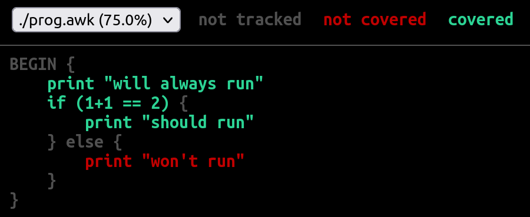

[](https://stand-with-ukraine.pp.ua)

# Code Coverage for GoAWK

_December 2022_

### TL;DR

I contributed to the [GoAWK](https://github.com/benhoyt/goawk) project by implementing the [code coverage](https://github.com/benhoyt/goawk/blob/master/docs/cover.md) functionality.

I'm grateful to [Ben Hoyt](https://benhoyt.com/) (the creator of GoAWK) for being really patient and helpful throughout my contribution process, providing thorough and insightful code reviews.

### What is code coverage?

In plain words, [code coverage](https://en.wikipedia.org/wiki/Code_coverage) is a measure that tells how much of your source code is executed by tests.

But why may we want it for [AWK](https://en.wikipedia.org/wiki/AWK)? 

### How the idea emerged / motivations

[Makesure](https://github.com/xonixx/makesure) is a task/command runner that I'm developing. It's sort of similar to the well-known `make` tool, but without most of its idiosyncrasies (and with a couple of unique features!).

It may sound surprising, but I wrote it in AWK. I won't lie: writing it in AWK started more out of curiosity than out of real need. To me, limits encourage creativity. Few people know nowadays that AWK is a full-fledged programming language, though really minimalistic. 

Makesure started more like an experiment to see how far writing a tool in AWK can go. It appears to be pretty far. I don't think this is an exception, but rather a consistent pattern, due to the true genius of the AWK authors.

To take an example from another project written in AWK:

> [I wrote a compiler in awk!](https://news.ycombinator.com/item?id=13452043)
>
> To bytecode; I wanted to use the awk-based compiler as the initial bootstrap stage for a self-hosted compiler. Disturbingly, it worked fine. Disappointingly, it was actually faster than the self-hosted version. But it's so not the right language to write compilers in. Not having actual datastructures was a problem. But it was a surprisingly clean 1.5kloc or so. awk's still my go-to language for tiny, one-shot programming and text processing tasks.

The other idea behind choosing AWK for Makesure is the ease of parsing. For example, when parsing this Makesure syntax:

```
@goal built
@depends_on tested
    gcc code.c 
```

If you know a bit of AWK, you understand that this syntax is fairly easy to parse with it. AWK already does word-splitting for you, so all you need is this:

```awk
if      ($1 == "@goal")       handleGoal($2)
else if ($1 == "@depends_on") handleDependency($2)
else                          handleCodeLine($0)
```

Essentially, using a limited tool for the job (AWK) motivates you to comply with the [Worse is better](https://en.wikipedia.org/wiki/Worse_is_better) principle, which I'm a big proponent of. You don't invent fancy syntax, but rather rely on syntax that can be parsed in a straight-forward way.

Time passed, and the source code for Makesure grew to a [pretty big awk file](https://github.com/xonixx/makesure/blob/main/makesure.awk). The tool had an extensive [test suite](https://github.com/xonixx/makesure/tree/main/tests), but I was not sure how good the coverage was, whether all critical scenarios were tested or not.

Thus the need to test coverage [became apparent](https://github.com/xonixx/makesure/issues/103). My research revealed that no AWK implementation had a code coverage facility. And so I decided to add one to an AWK implementation. The most suitable for such an addition appeared to be GoAWK.
 
Of course, some of my other motivations were practicing my Go and AWK programming skills. 

### How coverage works, in simple terms
                                        
Essentially, to collect code coverage statistics, we use source code instrumentation. That is, each line of code is annotated with a piece of tracking code (details below). Thus, when the instrumented program runs, the tracking code is triggered each time a code line is hit. At program completion, all collected coverage profile data is written to a file. This file is then used to create a human-friendly coverage report like the one below: 



### How code coverage for AWK differs from mainstream languages

For testing `makesure` I'm using the [tush](https://github.com/adolfopa/tush) tool. It provides a really nice and simple way to test a CLI tool as a black box.  

The tests in `tush` look like this:

```
$ command --that --should --execute correctly
| expected stdout output

$ command --that --will --cause error
@ expected stderr output
? expected-exit-code
```

(in my case the `command` is `makesure`)

When running such tests, `tush` runs all lines starting with `$` and simply compares the actual output with the expected output using a normal diff. If there is a difference, the test fails and the diff is displayed to the user.

In essence, such tests are end-to-end tests that are on the top of the well-known [testing pyramid](https://automationpanda.com/2018/08/01/the-testing-pyramid/). This is very good, since this style of testing is equivalent to how a _real_ user uses the tool, giving a much higher chance of catching _real_ bugs. 

Using this approach, I created a comprehensive test suite for Makesure, with a typical test file [looking like this](https://github.com/xonixx/makesure/blob/main/tests/10_define.tush).

The usual approach to testing (like in Go, Python or Java) is to create a set of tests (usually in multiple source files), then to use a "test runner" to run all them at once. And there lies a subtle but important difference from the approach described above.

In the case of a test runner, you run it once for all tests, so it can form the overall coverage profile when all the tests are completed.

In the case of `tush`, the program under test (`makesure`, and thus the `awk` underneath) is called many times with different arguments. Which means we want a way to assemble the final coverage profile incrementally. 

This poses additional implementation challenges. We need the ability for separate runs of an AWK program to be able to append to a single coverage profile. This implies that the internal format of this file needs to be "appendable", but also requires that the reporting facility that consumes the file understands this "appendability".

### How I thought of approaching the issue

A couple of years ago I came across the article [Code Coverage for Solidity](https://blog.colony.io/code-coverage-for-solidity-eecfa88668c2/). The article was pretty insightful for me, as it gave enough technical explanation, and described typical challenges when implementing code coverage for a particular programming language.  

The author based his implementation on the [Istanbul](https://istanbul.js.org/) coverage tool, initially targeted to JavaScript. But the author managed to generate coverage profiles for another language (Solidity) in Istanbul format, allowing him to reuse the reporting facility of Istanbul for free.

My plan was to use a similar approach. But my research showed that the Istanbul [coverage profile format](https://github.com/gotwarlost/istanbul/blob/master/coverage.json.md) was not append-friendly.

The other direction of my thought was defined by the classic book [The AWK Programming Language](https://archive.org/download/pdfy-MgN0H1joIoDVoIC7/The_AWK_Programming_Language.pdf) by Alfred V. Aho, Brian W. Kernighan, Peter J. Weinberger (the A, W, K of AWK). As an aside, this book is an absolute pleasure to read and amazingly relevant today, despite being published in 1988.

On pages 167-169 of this book is section "7.2 Profiling". It describes a very simple approach to how one can implement the profiling of a program with just two AWK scripts: `makeprof` and `printprof` (they're just a few lines of code each!).

`makeprof` does (admittedly naive) transformation of the input source by inserting a statement of the form `_LBcnt[i]++;` after each left brace `{`. Then it adds an `END` clause that outputs the collected statement counts in `_LBcnt` to a file. 

`printprof` attaches the statement counts from this file to the original program and displays the counts together with the original source code.

I was completely fascinated by the simplicity and clarity of this approach! 

Despite the fact that this approach is far from perfect and practical, I really considered using an improved version of this approach. However, it was clear that to make it more precise and robust, I'd need to transform the AWK program's AST (abstract syntax tree), not just perform a naive source code modification.

#### Chosen implementation approach

While working closely with AWK for my project, one day I came across GoAWK. Out of curiosity I tried running Makesure with it. This revealed some bugs in GoAWK, which I reported, and they were fixed promptly by Ben Hoyt, the creator. So eventually GoAWK passed the test suite of Makesure.

At that time I started getting interested in learning the Go programming language. So I was happy to contribute and fix some minor bugs I encountered. Overall, I really liked the GoAWK project and especially the author behind it. I can't help but recommend [Ben's technical blog](https://benhoyt.com/writings/) -- very well written and interesting.

So I thought that whatever implementation approach I choose, I would like to use GoAWK as a base. Since GoAWK was written in Go, I decided to take a look at the coverage support in Go itself. This was when I came across Go's ["cover story"](https://go.dev/blog/cover). I was immediately convinced! 

The functionality was not as advanced as Istanbul's, but still enough. The implementation seemed to be relatively simple. But most importantly, their coverage profile format appears to be designed with appendability in mind! (Though, to my knowledge, this feature is not directly used by the Go tools themselves). 

So I decided we should add code coverage functionality to GoAWK, but use Go's coverage profile format, so that we could reuse the Go machinery (`go tool cover`) to render the final report.

#### Failed (hacky) attempt

_To better understand what follows, it may be beneficial for the reader to first read [Ben's own writing on GoAWK](https://benhoyt.com/writings/goawk/)._

GoAWK uses pretty standard patterns in programming language implementation and execution strategy:

1. Firstly, the input AWK source (as a string) is processed by the [**Lexer**](https://benhoyt.com/writings/goawk/#lexer), outputting a list of tokens. 
2. Then the list of tokens serves as input for the [**Parser**](https://benhoyt.com/writings/goawk/#parser), the output of which is an AST (abstract syntax tree).
   - GoAWK also has the notion of a [**Resolver**](https://benhoyt.com/writings/goawk/#resolver) that was initially part of the parser. It analyzes the AST and annotates it with some additional data, like information about variable types. 
3. Afterwards, the AST [passes through](https://benhoyt.com/writings/goawk-compiler-vm/) the **Bytecode Compiler**, producing a list of opcodes and their arguments -- the GoAWK bytecode.
4. Finally, the bytecode serves as input to the **Interpreter**, which has a Virtual Machine inside. It runs the opcodes instruction by instruction to execute the program. 

Now I needed to understand how to fit the code coverage functionality into this scheme.

As I explained earlier, we need to instrument the source code for coverage tracking. It's much easier to explain using an example:

Given the following AWK source:

```awk
BEGIN {
    print "will always run"
    if ((1 + 1) == 2) {
        print "should run"
    } else {
        print "won't run"
    }
}
```

the instrumented code will look like this:

```awk
BEGIN {
    __COVER["3"] = 1     # track coverage
    print "will always run"
    if ((1 + 1) == 2) {
        __COVER["1"] = 1 # track coverage
        print "should run"
    } else {
        __COVER["2"] = 1 # track coverage
        print "won't run"
    }
}
```

It was obvious that this tracking code insertion should take place at the AST level. So I imagined we'd need to add an additional step between 2 and 3: it would take AST as input, pass it through a "coverage annotator" (yet to be added), and produce the transformed AST.

But it wasn't so simple in practice! The main problem was the tight connection between the parser and resolver. In fact, both of them happened in the same pass, so it was impossible to run them separately. 

Let me explain why this is important. If I just changed the AST by adding the required nodes for the `__COVER["N"] = 1` statements, those new nodes would lack some tiny (but important) pieces of information filled in by the resolver. So somehow I needed to run the updated AST through the resolution step once again. But this was technically impossible, because the resolver (being part of the parser) could only consume what the parser consumes -- that is, the list of tokens.

So, I thought, why not just render the modified AST back to AWK source and then start the whole process from step 1. Luckily, GoAWK already had a `String()` implementation for all AST nodes, so it could render AST back to AWK source. Unluckily, this AWK source [was not guaranteed to be correct in all cases](https://github.com/benhoyt/goawk/issues/142), because its purpose was to output the parsed AST for debugging (the `-d` flag).

This is when I added the first dirty hack: I patched the instrumented AST (more precisely, the inserted pieces) as if this was done by Resolver itself. 

The second hack I used was even nastier. When I inserted coverage instrumentation like so:

```awk
__COVER["2"] = 1
```

I also internally store the information that describes it, such as the filename and source lines being covered. This information is captured in the [`trackedBlock` struct](https://github.com/benhoyt/goawk/blob/d7911647f3b08af099b50c9e991e72cfacdd1e2e/internal/cover/cover.go#L43).

So internally we have the following (Go pseudocode):

```go
trackedBlocks[2] = trackedBlock{ 
   path:     "/path/to/script.awk", 
   start:    "2:3", 
   end:      "35:13", 
   numStmts: 34,
}
```

Storing this data is needed for building the resulting coverage profile (in the format used by `go cover`), which looks like this:

```
...
/path/to/script.awk:2.3,35.13 34 1
/path/to/script.awk:41.39,41.51 1 0
/path/to/script.awk:40.5,41.39 2 0
/path/to/script.awk:42.27,42.42 1 0
...
```

Each line above describes collected coverage for some block of code, and has the following format:

```
<source_file_path>:<column_from>.<line_from>,<column_to>.<line_to> <num_stmts> <exec_count>
```

Now, remember that you can run AWK with multiple source files, like so:

```
awk -f file1.awk -f file2.awk -f file3.awk
```

But GoAWK, in step 1 above, just joined all source files into a single string and used that as input to the lexer. 

This means that by the time we've got the AST after step 2, there is no way to tell which AST node came from what input file. Thus, we aren't able to fill in the `path` field for our `trackedBlock` during instrumentation.

So to pass the required `path` information to the AST, it needs to wire it through both the lexer and parser, I thought. For this I introduced a ["fake" token](https://github.com/benhoyt/goawk/compare/070521a687628ad88f731b734077f15e6ec16f92...c067bfc8212836ad9cd6cb1783bfdfb6d61a0b7b) that I inserted at the start of each file. Thus, when sources were joined, this token represented files boundaries, which meant that at parse time I was able to track the filenames and local positions in each file.  


#### Refactorings

Although the approach worked well in practice, it was clear that it was ugly, and that it had zero chance to be merged as is. Ben came up with a [list of code review remarks](https://github.com/benhoyt/goawk/issues/144#issuecomment-1223087337) about structural things he'd like to see addressed before merging this in.

There was no other way than to undertake a couple of serious refactorings before we attempting to merge my code coverage support.

Frankly, I was not upset at all, but rather excited! Firstly, I got a chance to do even more useful work for a project I liked. And I was glad to keep sharpening my Go fu further.

The biggest thing to start with was decoupling the parse and resolve steps. This was a bit scary to touch. Even Ben described this part of code as follows:

> In fact, the resolver was one of the harder pieces of code I’ve written for a while. It’s the one piece of the GoAWK source I’m not particularly happy with. It works, but it’s messy, and I’m still not sure I’ve covered all the edge cases.

But I think I understood how it worked overall, and how I could do the refactoring. Reading Ben's tech writing was a big help. 

I needed a way to traverse (and update) the AST for the resolving step after parsing. 

For this [I used the visitor pattern](https://github.com/benhoyt/goawk/blob/master/internal/ast/walk.go), very similar to the one [used in Go itself](https://github.com/golang/go/blob/690ac4071fa3e07113bf371c9e74394ab54d6749/src/go/ast/walk.go). Once the visitor functionality was in place, the AST traversal needed for resolving [was easy](https://github.com/benhoyt/goawk/blob/d7911647f3b08af099b50c9e991e72cfacdd1e2e/internal/resolver/resolve.go#L59).

My [other refactoring](https://github.com/benhoyt/goawk/pull/153) served the purpose of resolving global positions in the joined source code back to local positions in the input source files. This was needed to get rid of hack #2 mentioned above.

When both the refactorings were reviewed and merged to master I was able to submit my [final clean implementation of code coverage](https://github.com/benhoyt/goawk/pull/154) on top.

Overall, I highly recommend this approach to big contributions. You should not try to fit all your changes into a single pull request. Each PR should be highly cohesive, that is, solve only a single problem. That is much easier for the project owner to review and accept such PRs. Also, such PRs will be valuable on their own, even if not all of them manage to reach the master branch. As John Ousterhout says, [problem decomposition is the most important idea in all of computer science](https://www.youtube.com/watch?v=bmSAYlu0NcY&t=187s). 

### Results

Running GoAWK coverage on Makesure revealed [uncovered code](https://github.com/xonixx/makesure/issues/111). This helped to find a bug (which has already been fixed).

### What's lacking

As I've mentioned, Go's approach to code coverage is not very advanced. It implements _statement_ coverage rather that _branch_ coverage (the same applies to GoAWK coverage). For simplicity, [it doesn't cover some corner cases](https://go.dev/blog/cover#basic-blocks). Other coverage tools, like Istanbul can provide more detailed coverage, like coverage for [both clauses in a ternary operator](https://blog.colony.io/code-coverage-for-solidity-eecfa88668c2/#the-ternary-operator) or the [invisible else branch](https://blog.colony.io/code-coverage-for-solidity-eecfa88668c2/#invisible-else-branches).

To illustrate that last point, let's imagine this code:

```awk
if (condition) {
    print "body"
}
print "after"
```

You can have it all green, but still something is not covered: the implicit "else" branch is not covered. In other words, we want to make sure both true and false variants for `condition` are covered.

It would be really nice to improve this for GoAWK coverage and maybe even for Go itself, but I'll leave that for future work!
  

### Links

- [GoAWK code coverage article by Ben Hoyt](https://benhoyt.com/writings/goawk-coverage/)
- [GoAWK coverage documentation](https://github.com/benhoyt/goawk/blob/master/docs/cover.md)
- [GoAWK, an AWK interpreter written in Go](https://benhoyt.com/writings/goawk/)
- [The Go Blog: "The cover story" by Rob Pike](https://go.dev/blog/cover)
- [Code Coverage for Solidity](https://blog.colony.io/code-coverage-for-solidity-eecfa88668c2/)
- [The AWK Programming Language](https://archive.org/download/pdfy-MgN0H1joIoDVoIC7/The_AWK_Programming_Language.pdf) -- the book by the AWK creators, a must read!
