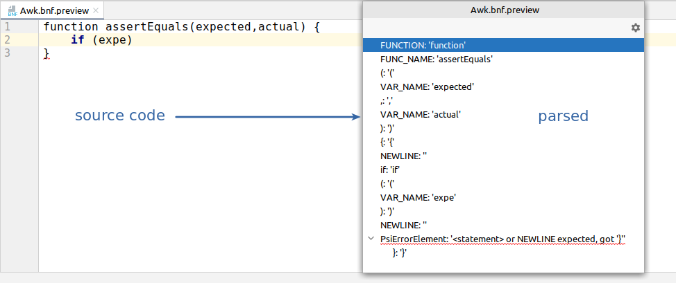
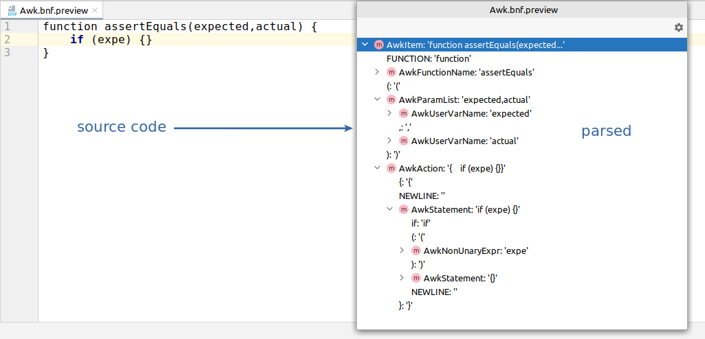

# How I accidentally optimized the parsing in IntelliJ-AWK

_TODO 2023_

### TL;DR

[IntelliJ-AWK](https://github.com/xonixx/intellij-awk) is a language support plugin for AWK that I develop for the IntelliJ IDEA.

***

The story started with this [issue](https://github.com/xonixx/intellij-awk/issues/133). The autocomplete was not working in the presence of not-closed `if`:

                           
This is because in the presence of incomplete code the AST (abstract syntax tree) for a program can be incomplete or broken.

### Why so?

Let's elaborate a bit. Autocompletion in IDE works by querying the nodes of the AST representation of a source code that is built by IDE behind the scene. To help you get the idea, the AST is conceptually similar to the DOM in HTML. It's a tree-like structure that represents a parsed form of a program code. So, for example, to autocomplete the function names we need to traverse the AST tree and find all nodes of type `"function"`.

Now, what does it take to turn the source code (text) into AST?
It appears, that this is a two-step process:
- first is **Lexer** - it takes input source as _string_ and produces a _list of tokens_
- second is **Parser** - it takes a _list of tokens_ from Lexer and builds an _AST_

[Why lexing and parsing should be separate?](https://github.com/oilshell/oil/wiki/Why-Lexing-and-Parsing-Should-Be-Separate)
                
Technically, lexing is usually implemented by auto-generating the Lexer algorithm code from a lexing grammar [like this](https://github.com/xonixx/intellij-awk/blob/main/src/main/java/intellij_awk/Awk.flex).

Likewise, Parser is usually auto-generated from a parsing grammar [like this](https://github.com/xonixx/intellij-awk/blob/main/src/main/java/intellij_awk/Awk.bnf).

However, it's also common to see manually written lexers and parsers.

It appears, that only lexing step is enough if you only need to highlight the source code. You don't need to build the full-fledged AST, you only need to know the actual tokens and color them in different colors by token type.

However, for any more advanced functionality, like aforementioned autocomplete, you need the AST. 

But here is the problem. Usually, Parser can only build a complete and correct AST tree for complete and correct source code. However, when we are typing the program in IDE most of the time our source is incomplete. Thus, it's simply _invalid_ for the Parser.

Let's see the actual example. Compare how the incomplete code is parsed (just linear list of tokens with the error at the end):

And how the complete code is parsed (AST tree is present):
