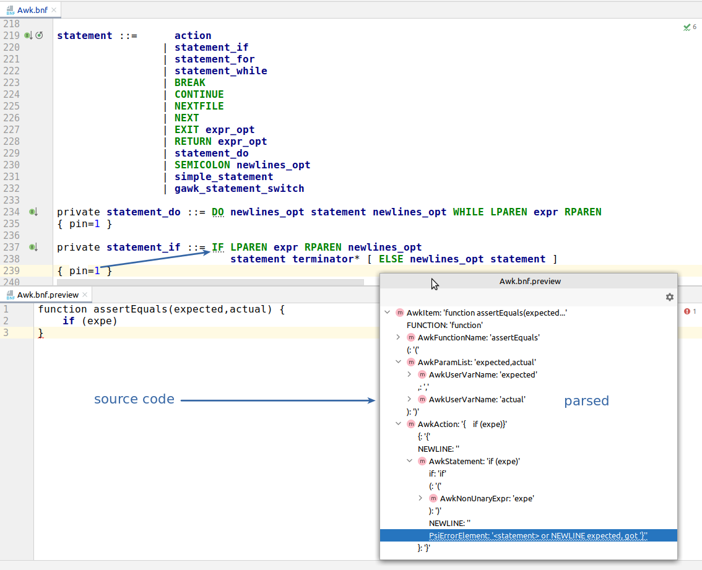

# How I accidentally optimized the parsing in IntelliJ-AWK

_TODO 2023_

### TL;DR

[IntelliJ-AWK](https://github.com/xonixx/intellij-awk) is a language support plugin for AWK that I develop for the IntelliJ IDEA.

I will describe how I tweaked the parsing grammar to solve one specific issue and coincidentally this sped up the parsing and allowed to remove some "code hacks".  

The article may be of interest to people developing a language support plugin for IntelliJ IDEA, or people interested in practical language parsing algorithms.

***

The story started with this [issue](https://github.com/xonixx/intellij-awk/issues/133). The autocomplete was not working in the presence of not-closed `if`:


                           
### Why so?

Let's elaborate a bit. Autocompletion in IDE works by querying the nodes of the AST (abstract syntax tree) representation of a source code that is built by IDE behind the scene. To help you get the idea, the AST is conceptually similar to the DOM in HTML. It's a tree-like structure that represents a parsed form of a program code. So, for example, to autocomplete the function names we need to traverse the AST tree and find all nodes of type `"function"`.

Now, what does it take to turn the source code (text) into AST?
It appears, that this is a two-step process:
- first is **Lexer** - it takes input source as _string_ and produces a _list of tokens_
- second is **Parser** - it takes a _list of tokens_ from Lexer and builds an _AST_

[Why lexing and parsing should be separate?](https://github.com/oilshell/oil/wiki/Why-Lexing-and-Parsing-Should-Be-Separate)
                
Technically, lexing is usually implemented by auto-generating the Lexer algorithm code from a lexing grammar [like this](https://github.com/xonixx/intellij-awk/blob/main/src/main/java/intellij_awk/Awk.flex).

Likewise, Parser is usually auto-generated from a parsing grammar [like this](https://github.com/xonixx/intellij-awk/blob/main/src/main/java/intellij_awk/Awk.bnf).

However, it's also common to see manually written lexers and parsers.

It appears, that only lexing step is enough if you only need to highlight the source code. You don't need to build the full-fledged AST, you only need to know the actual tokens and color them in different colors by token type.

However, for any more advanced functionality, like aforementioned autocomplete, you need the AST. 

But here is the problem. Usually, Parser can only build a complete and correct AST tree for complete and correct source code. However, when we are typing the program in IDE most of the time our source is incomplete. Thus, it's simply _invalid_ for the Parser.

Let's see the actual example. Compare how the incomplete code is parsed (just linear list of tokens with the error at the end):


And how the complete code is parsed (AST tree is present):


### Using `pin` and `recoverWhile`

In practice, it's desirable for the IDE use-case to implement a parsing algorithm that is capable of building (at least partial) AST even in presence of parsing errors. In other words, parser should be able to "recover" from the error and keep building syntax tree from subsequent tokens.

The parsing solution provided by IDEA, called Grammar-Kit, has means for this. It has two attributes that you can add to grammar rules to hint the parser on how to recover from parsing errors: `pin` and `recoverWhile`, described in docs ([1](https://github.com/JetBrains/Grammar-Kit/blob/master/TUTORIAL.md), [2](https://github.com/JetBrains/Grammar-Kit/blob/master/HOWTO.md#22-using-recoverwhile-attribute)).

The key for our case is the `pin` one. You add it to a parsing rule by specifying the token index in a rule, after reaching which the parser will consider the rule match as successful, even if the rest of the tokens required for the rule is absent. It's okay if this was completely incomprehensible. Let's see on the same example.

Now I just added the `{ pin=1 }` to the `statement_if` rule. Note, how now, even in presence of parsing error the AST tree is built.



The error now is represented by the error AST leaf node at the end of "partially parsed" AST element (in this case, `AwkStatement`).

To someone who knows Prolog the behavior of `pin` will remind cuts (`!`).
Because it makes the parser to commit to the chosen parse choice once the specified token is reached, by canceling the backtracking for the  rule with pin. 

Also, to me the idea of pins has very clear logical sense. Once someone typed `if` (with space after it) it's already clear this will be `statement_if`. User simply has no option to type something other than `(condition) actions`, since in all cases this will be a syntax error. So it's logical for parser to assume `statement_if` AST element after seeing only the `if` token.

### The tricky AWK grammar

If it were as simple as adding `pin` attributes to a grammar, I wouldn't be writing this article.

In my [AWK technical notes](awk_tech_notes.md) I've already mentioned, that due to a somewhat ad-hoc AWK syntax the language has a [parsing grammar](https://pubs.opengroup.org/onlinepubs/9699919799/utilities/awk.html#tag_20_06_13_16) with some peculiarities, including even ambiguities.

The other such peculiarity can be observed in this piece of grammar:

```bnf
action           : '{' newline_opt                             '}'
                 | '{' newline_opt terminated_statement_list   '}'
                 | '{' newline_opt unterminated_statement_list '}'
                 ;

...

terminated_statement_list : terminated_statement
                 | terminated_statement_list terminated_statement
                 ;

unterminated_statement_list : unterminated_statement
                 | terminated_statement_list unterminated_statement
                 ;

terminated_statement : action newline_opt
                 | If '(' expr ')' newline_opt terminated_statement
                 | If '(' expr ')' newline_opt terminated_statement
                       Else newline_opt terminated_statement
                 | While '(' expr ')' newline_opt terminated_statement
                 | For '(' simple_statement_opt ';'
                 ...
                 ;

unterminated_statement : terminatable_statement
                 | If '(' expr ')' newline_opt unterminated_statement
                 | If '(' expr ')' newline_opt terminated_statement
                      Else newline_opt unterminated_statement
                 | While '(' expr ')' newline_opt unterminated_statement
                 | For '(' simple_statement_opt ';'
                 ...
                 ;
```

You can notice, there is some duplication here


### Result

Speed-up


