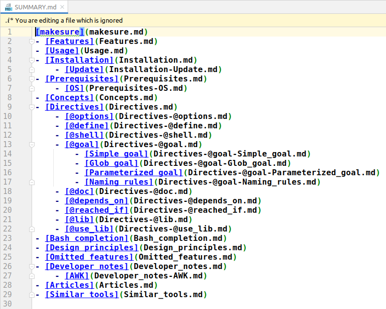

# mdbooker -- turn your README.md into a documentation site

_March 2024_

In this article I want to present you the tiny utility [mdbooker](https://github.com/xonixx/mdbooker). 

It allows me to convert my project's [README.md](https://github.com/xonixx/makesure) into a beautiful documentation site [makesure.dev](https://makesure.dev).

The utility works in conjunction with the amazing [mdBook](https://github.com/rust-lang/mdBook) tool.

## How it works

`mdBook` generates a documentation site (a "book") from a set of markdown files based on a [SUMMARY.md](https://rust-lang.github.io/mdBook/format/summary.html).

Therefore, `mdbooker` splits your README.md into a set of markdown files (based on header titles) and generates the SUMMARY.md.


## Usage

### Step 1: run mdbooker

```sh
REPO=username/reponame \
BOOK=path/to/book_folder \
  awk -f mdbooker.awk README.md
```

where

- `username/reponame` - the GitHub repository where README resides. This is needed to correctly rewrite relative links.
- `path/to/book_folder` (optional, default `./book`) - the output folder for generated markdown files.

### Step 2: run mdBook

```sh
mbdook build
```

### Step 3: deploy the website

The deployment of final html/js/css (as generated by the previous step) to the public web is out of scope of this article.

## Technical details

The project is implemented as a single-file [AWK script](https://github.com/xonixx/mdbooker/blob/main/mdbooker.awk) ([Wait... What?!](awk.md)).

This part can be of interest to those who would like to sharpen their AWK-fu a bit.

Before explaining some bits of my implementation let's come up with the requirements.

1. SUMMARY.md should be generated with a structure (nesting) determined by `## titles` in README.md.
2. README.md is split into separate .md-files named by header titles.
3. Cross-README links are "fixed". In markdown you can reference any `## Section Title` by a `href="#section-title"`. This requires special handling. 
4. Relative links are "fixed". Since README.md resides in a repository it can reference any project file by its relative path. This requires special handling.
5. "Empty" sections should be filled by the list of links to their child sub-sections. This is needed when `## section` is immediately followed by `### sub-section` (So we want [this](https://makesure.dev/Directives.html) instead of [this](https://just.systems/man/en/chapter_22.html)).   

Now let's take a look at how these requirements are implemented in code.
 
This implementation requires parsing (traversing) the input file README.md two times. 

- First pass [is done](https://github.com/xonixx/mdbooker/blob/5602b433bfc78d1404e9d610c150920a049e6eb8/mdbooker.awk#L16) via standard AWK's pattern matching syntax. This pass
  - [prepares the mapping for cross-README link](https://github.com/xonixx/mdbooker/blob/5602b433bfc78d1404e9d610c150920a049e6eb8/mdbooker.awk#L25) (requirement 3.)
  - [populates "empty" sections](https://github.com/xonixx/mdbooker/blob/5602b433bfc78d1404e9d610c150920a049e6eb8/mdbooker.awk#L27) (requirement 5.)
- Second pass [is invoked](https://github.com/xonixx/mdbooker/blob/5602b433bfc78d1404e9d610c150920a049e6eb8/mdbooker.awk#L45) in the `END { ... }` block. [Here](https://github.com/xonixx/mdbooker/blob/5602b433bfc78d1404e9d610c150920a049e6eb8/mdbooker.awk#L49) it explicitly traverses our file again (`FILENAME` is a variable equal to the file passed to `awk` command, README.md in our case). This pass:
  - Uses data, collected in pass 1
  - [Collects content](https://github.com/xonixx/mdbooker/blob/5602b433bfc78d1404e9d610c150920a049e6eb8/mdbooker.awk#L63) for each section
  - [Fixes cross-links](https://github.com/xonixx/mdbooker/blob/5602b433bfc78d1404e9d610c150920a049e6eb8/mdbooker.awk#L54-L55) (requirement 3.)
  - [Fixes relative links](https://github.com/xonixx/mdbooker/blob/5602b433bfc78d1404e9d610c150920a049e6eb8/mdbooker.awk#L57-L61) (requirement 4.). Note, how file links `[title](link)` and image links `` require different handling.
  - [Populates SUMMARY.md](https://github.com/xonixx/mdbooker/blob/5602b433bfc78d1404e9d610c150920a049e6eb8/mdbooker.awk#L37) (requirement 1.)
  - [Populates a separate .md-file per section](https://github.com/xonixx/mdbooker/blob/5602b433bfc78d1404e9d610c150920a049e6eb8/mdbooker.awk#L33-L34) (requirement 2.)
    
***

Couple more AWK trick.

Let me remind you how in markdown the hierarchy of headers is defined:

| md          | html             |
|-------------|------------------|
| `# Title`   | `<h1>Title</h1>` |
| `## Title`  | `<h2>Title</h2>` |
| `### Title` | `<h3>Title</h3>` |
| etc.        |                  |

So to parse nesting you need to parse the number of `#`. How do you do it with AWK?

It appears, AWK's `match()` function can match a regex in a string, and it sets `RSTART` and `RLENGTH` for you:

```
$ awk 'BEGIN { match("#####",/^#+/); print "RSTART="RSTART", RLENGTH="RLENGTH }'
RSTART=1, RLENGTH=5
```

This explains [this line](https://github.com/xonixx/mdbooker/blob/5602b433bfc78d1404e9d610c150920a049e6eb8/mdbooker.awk#L16).

***

With awk you can easily produce the needed indentation using `printf`. 

This usage is common:

```
$ awk 'BEGIN { printf "%10s\n", "hello" }'
     hello
```
This is not that obvious:
```
$ awk 'BEGIN { N=10; printf "%" N "s\n", "hello" }'
     hello
```
But this gives you:
```
$ awk 'BEGIN { for (N=5;N<10;N++) printf "%" N "s\n", "hello" }'
hello
 hello
  hello
   hello
    hello
```

This explains the logic in [this line](https://github.com/xonixx/mdbooker/blob/5602b433bfc78d1404e9d610c150920a049e6eb8/mdbooker.awk#L37). It allows producing this structure:



I hope this information should be enough to explain the logic of my script.
 
***

Here is an example tool's output:
```
will use BOOK=book
  fix image link: coverage.svg -> https://github.com/xonixx/makesure/raw/main/coverage.svg
generating: makesure.md...
  fix #link: #installation -> Installation.md
  fix #link: #os -> Prerequisites-OS.md
  fix #link: #reached_if -> Directives-@reached_if.md
  fix relative link: Makesurefile -> https://github.com/xonixx/makesure/blob/main/Makesurefile
generating: Features.md...
generating: Usage.md...
generating: Installation.md...
generating: Installation-Update.md...
generating: Prerequisites.md...
generating: Prerequisites-OS.md...
  fix #link: #directives -> Directives.md
  fix #link: #goal -> Directives-@goal.md
  fix #link: #depends_on -> Directives-@depends_on.md
  fix #link: #reached_if -> Directives-@reached_if.md
generating: Concepts.md...
generating: Directives.md...
generating: Directives-@options.md...
  fix relative link: tests/24_define_everywhere.sh -> https://github.com/xonixx/makesure/blob/main/tests/24_define_everywhere.sh
generating: Directives-@define.md...
generating: Directives-@shell.md...
generating: Directives-@goal.md...
generating: Directives-@goal-Simple_goal.md...
  fix #link: #naming-rules -> Directives-@goal-Naming_rules.md
generating: Directives-@goal-Glob_goal.md...
  fix relative link: docs/parameterized_goals.md -> https://github.com/xonixx/makesure/blob/main/docs/parameterized_goals.md
generating: Directives-@goal-Parameterized_goal.md...
generating: Directives-@goal-Naming_rules.md...
generating: Directives-@doc.md...
generating: Directives-@depends_on.md...
generating: Directives-@reached_if.md...
generating: Directives-@lib.md...
generating: Directives-@use_lib.md...
generating: Bash_completion.md...
generating: Design_principles.md...
generating: Omitted_features.md...
  fix relative link: docs/DEVELOPER.md -> https://github.com/xonixx/makesure/blob/main/docs/DEVELOPER.md
generating: Developer_notes.md...
generating: Developer_notes-AWK.md...
generating: Articles.md...
generating: Similar_tools.md...
```
  
## Alternatives

The only alternative I've found is [Docsify](https://colinhacks.com/essays/docs-the-smart-way) -- small JS lib that renders your README.md as a single-page website. I didn't like it, though, because such single-pages usually give poor user experience.