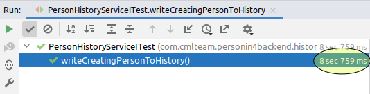
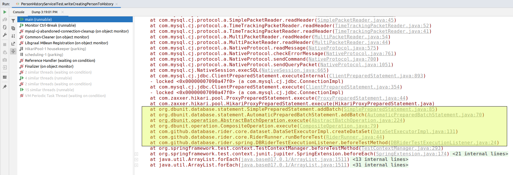

# TODO

_March 2023_

## Problem description

At [CML Team](https://www.cmlteam.com) we are building our own (yet internal) CRM system.
Technology-wise, it's a traditional web application with Java + Spring Boot + MySQL on the backend and React + Next.js on the frontend.

We have pretty good code coverage for the backend (reaching 80%) with tests, but the integration tests are (as expected) rather slow. It takes 20+ minutes to run on CI server. It's even slower running locally.

Needless to say, this slowness renders tests much less useful and helpful for the developers, since they practically can't run the tests locally often enough.

## Source of slowness

At CML Team we value integration/functional tests. So we tend to write tests with less mocks, tests that spans all layers of the (Java) application (controllers, services, repositories) -- down to (and including) the DB. The tests run on the real database (MySQL), not on often recommended H2. 

Overall, the idea is, the closer your tests follow _real_ (human) use-cases and real application setup, the higher chances to catch _real_ bugs.

Of course, we write unit-tests when applicable. But otherwise, we prefer end-to-end tests to tests for a specific controller, service or component.

It's clear that such tests are inherently slow, but they should not be _that_ slow! It was time to take a deeper look to understand what's going on.

***

Let's take a look at typical test we had there:

```java
@ExtendWith(SpringExtension.class)
@AutoConfigureMockMvc
@SpringBootTest
@DBRider
@DBUnit(
        leakHunter = true,
        mergeDataSets = true,
        caseSensitiveTableNames = true,
        allowEmptyFields = true)
class PersonHistoryServiceITest {
    @Test
    @WithUserDetails(value = "user1@mail.com", setupBefore = TestExecutionEvent.TEST_EXECUTION)
    @CleanDataBaseBeforeAndAfter("db_rider_data/controller/person/init_data.json")
    @ExpectedDataSet(
            value = "db_rider_data/history/person/add/data_after_save_person.json",
            ignoreCols = {"id", "person_id", "modified_at", "element_id"})
    void writeCreatingPersonToHistory() throws Exception {
        mockMvc
                .perform(
                        MockMvcRequestBuilders.post("/attendee/create")
                                .contentType(MediaType.APPLICATION_JSON)
                                .content(asJsonString(getPersonCreateRequestDtoNewPersonNewCompany())))
                .andExpect(status().is2xxSuccessful());
    }
}
```

The test uses the annotations from the [Database Rider](https://database-rider.github.io/database-rider/) project.

As you can see, this test has the following logic:
1. Firstly, it wipes the DB and fills it with initial data in `@CleanDataBaseBeforeAndAfter(".../init_data.json")`
2. Then, it runs the body of the test method, that executes a REST call to the API being tested
3. Finally, it tests the correctness of the final state of the DB via `@ExpectedDataSet(...)`

It appears that this test takes whopping 8+ seconds to execute:



And if we take some thread dumps during the execution, we'll see, that major part of this time is spent in DB Rider plugin applying the initial state to the DB (`init_data.json`):




## The rewrite strategy

## Why the new approach is better?

## Results