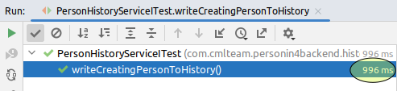

# TODO

_March 2023_

## Problem description

At [CML Team](https://www.cmlteam.com) we are building our own (yet internal) CRM system.
Technology-wise, it's a traditional web application with Java + Spring Boot + MySQL on the backend and React + Next.js on the frontend.

We have pretty good code coverage for the backend (reaching 80%) with tests, but the integration tests are (as expected) rather slow. It takes 20+ minutes to run on CI server. It's even slower running locally.

Needless to say, this slowness renders tests much less useful and helpful for the developers, since they practically can't run the tests locally often enough.

## Source of slowness

At CML Team we value integration/functional tests. So we tend to write tests with less mocks, tests that span all layers of the (Java) application (controllers, services, repositories) -- down to (and including) the DB. The tests run on the real database (MySQL), not on often recommended H2. 

Overall, the idea is, the closer your tests follow _real_ (human) use-cases and _real_ application setup, the higher are the chances to catch _real_ bugs.

Of course, we write unit-tests when applicable. But otherwise, we prefer end-to-end tests to tests for a specific controller, service or component.

It's clear that such tests are inherently slow, but they should not be _that_ slow! It was time to take a deeper look to understand what's going on.

***

Let's take a look at typical test we had there:

```java
@ExtendWith(SpringExtension.class)
@AutoConfigureMockMvc
@SpringBootTest
@DBRider
@DBUnit(
        leakHunter = true,
        mergeDataSets = true,
        caseSensitiveTableNames = true,
        allowEmptyFields = true)
class PersonHistoryServiceITest {
    @Test
    @WithUserDetails(value = "user1@mail.com", setupBefore = TestExecutionEvent.TEST_EXECUTION)
    @CleanDataBaseBeforeAndAfter("db_rider_data/controller/person/init_data.json")
    @ExpectedDataSet(
            value = "db_rider_data/history/person/add/data_after_save_person.json",
            ignoreCols = {"id", "person_id", "modified_at", "element_id"})
    void writeCreatingPersonToHistory() throws Exception {
        mockMvc
                .perform(
                        MockMvcRequestBuilders.post("/attendee/create")
                                .contentType(MediaType.APPLICATION_JSON)
                                .content(
                                        asJsonString(
                                                PersonCreateRequestDto.builder()
                                                        .fullName(fullName)
                                                        .country("US")
                                                        .build())))
                .andExpect(status().is2xxSuccessful());
    }
}
```

The test uses the annotations from the [Database Rider](https://database-rider.github.io/database-rider/) project.

As you can see, this test has the following logic:
1. Firstly, it wipes the DB and fills it with initial data in `@CleanDataBaseBeforeAndAfter(".../init_data.json")`
2. Then, it runs the body of the test method, that executes a REST call to the API being tested
3. Finally, it tests the correctness of the final state of the DB via `@ExpectedDataSet(...)`

It appears that this test takes whopping 8+ seconds to execute:


And if we take some thread dumps during the execution, we'll see, that major part of this time is spent in the Database Rider plugin applying the initial state to the DB (`init_data.json`):


Here is an excerpt from `init_data.json`:

```json5
{
  "person": [
    {
      "id": 1,
      "country": "IE",
      "phone": "+111111111",
      "email": "john@test",
      "whatsapp": "1111111",
      "telegram": "@JohnS",
      "instagram": "@john_s",
      "facebook": "https://facebook.com/JohnS",
      "created_date": "1669125329768",
      "modified_date": "1669125329768",
      "first_name": "John",
      "last_name": "Smith",
      "outsourcing_history": "Found on clutch",
      "added_by": "IMPORTED_FROM_SPREADSHEET",
      "deleted": 0
    },
    // ... 
  ],
  "avatar": [
    {
      "id": 1,
      "person_id": 1,
      "photo_url": "https://web-summit/photos/1",
      "main": 1,
      "deleted": 0
    },
    {
      "id": 2,
      "person_id": 3,
      "photo_url": "https://web-summit/photos/2",
      "main": 1,
      "deleted": 0
    },
    // ...
  ],
  "company": [
    {
      "id": 1,
      "company_funding": 100,
      "company_valuation": 25,
      "employees_amount": 60,
      "linkedin": "http://new_linked_in/good",
      "name": "Good company",
      "website": "www.good-company.com"
    },
    // ...
  ],
  "person_company": [
    {
      "company_id": 1,
      "person_id": 1
    },
    {
      "company_id": 1,
      "person_id": 2
    },
    // ...
  ],
  "conference": [
    {
      "id": 1,
      "start_date": "2022-05-06",
      "end_date": "2022-05-09",
      "link": "www.some.conference",
      "location": "San Francisco",
      "conference_name": "First conference",
      "type": "ONLINE"
    },
  ]
  // ...
}
```

Overall, the dataset there is not big:

```
$ cat 'src/test/resources/db_rider_data/controller/person/init_data.json' | jq '[.[] | length] | add'
35
```

So it should be only 35 SQL inserts.

I have some guesses why this can take so long:

- Obviously, to turn `init_data.json` into a set of SQL inserts the Database Rider must determine the correct insertion order, according to entity relations (like foreign keys). So I guess, as a part of this routine it needs to first fetch the whole database metadata and then apply some topological sorting to the source dataset. 
- I'm not quite sure, how efficiently does the Database Rider do the inserts. Whether it in an auto-commit mode? Whether it does each insert in a separate transaction or not? 
- As `init_data.json` is shared among multiple tests, it, probably,  contains more data than needed for this particular test.


## The rewrite strategy

Given the concerns above, the rewrite strategy was obvious. Get rid of Database Rider annotations and code DB initialization and DB check steps in plain code.

The same test looks now:

```java
@ExtendWith(SpringExtension.class)
@AutoConfigureMockMvc
@SpringBootTest
class PersonHistoryServiceITest {
  @Test
  void writeCreatingPersonToHistory() throws Exception {
    // GIVEN
    DbTestHelper.Transaction transaction = dbTestHelper.startTransactionOnCleanDb();
    User user = testDataFactory.newAdmin();
    transaction.commit();

    String fullName = "John Doe";

    // WHEN
    MvcResult result =
        mockMvc
            .perform(
                post("/attendee/create")
                    .with(user(user))
                    .contentType(MediaType.APPLICATION_JSON)
                    .content(
                        asJsonString(
                            PersonCreateRequestDto.builder()
                                .fullName(fullName)
                                .country("US")
                                .build())))
            .andExpect(status().isOk())
            .andReturn();

    // THEN
    checkPersonHistoryCreated(ITestHelper.extractId(result), user, ADD, "Person", null, fullName);
  }
}
```

And runs in 1 second:



So now instead of having implicit logic, hidden in annotations we have it in code, in `// GIVEN` and `// THEN` sections. Similarly, the annotations `@WithUserDetails` is now explicit line of code `.with(user(user))`.

The `dbTestHelper` encapsulates the functionality of cleaning the DB and starting/committing the transactions, common for many tests:

```java
@Component
@RequiredArgsConstructor
public class DbTestHelper {
    private final EntityManager entityManager;
    private final PlatformTransactionManager platformTransactionManager;

    public interface Transaction {
        void commit();
    }

    Transaction startTransaction() {
        TransactionStatus transactionStatus =
                platformTransactionManager.getTransaction(TransactionDefinition.withDefaults());
        return () -> platformTransactionManager.commit(transactionStatus);
    }

    public Transaction startTransactionOnCleanDb() {
        Transaction transaction = startTransaction();
        cleanupDb();
        return transaction;
    }

    void cleanupDb() {
        try (Session session = entityManager.unwrap(Session.class)) {
            session.doWork(
                    connection -> {
                        Statement statement = connection.createStatement();
                        for (String table : tables) {
                            statement.addBatch("delete from personin4_integration." + table);
                        }

                        statement.executeBatch();
                    });
        }
    }

    private static final String[] tables =
            new String[]{
                    "person_industry",
                    "person_company_position",
                    "person_company"
                    // ... all other tables 
            };
}
```

The main purpose of `testDataFactory` is to generate the testing data records in the DB. So by default it should generate the same entity for any test, but should also have a common way of customizing each instance before the generation. This is achieved by `EntityCustomizer`:

```java
@Component
@RequiredArgsConstructor
public class TestDataFactory {
    private final EntityManager entityManager;
    private static final EntityCustomizer nop = o -> {};

    public interface EntityCustomizer<Entity> {
        void customize(Entity entity);
    }

    private <Entity> Entity customizeAndPersist(
            EntityCustomizer<Entity> entityCustomizer, Entity entity) {
        entityCustomizer.customize(entity);
        entityManager.persist(entity);
        return entity;
    }

    public User newAdmin() {
        return newUser(user -> user.setRole(ROLE_ADMIN));
    }

    public User newUser() {
        return newUser(user -> user.setRole(ROLE_USER));
    }

    public User newUser(EntityCustomizer<User> userCustomizer) {
        return customizeAndPersist(
                userCustomizer,
                new User(
                        null,
                        true,
                        "example2@mail.com",
                        "username_2",
                        null,
                        true,
                        true,
                        true,
                        true,
                        "qwerty",
                        "John",
                        "Smith",
                        ROLE_USER,
                        null,
                        false,
                        newAccount(),
                        null,
                        null,
                        null,
                        null,
                        null,
                        null,
                        List.of(),
                        false));
    }

    public Person newPerson() {
        return newPerson(nop);
    }

    public Person newPerson(EntityCustomizer<Person> personCustomizer) {
        return customizeAndPersist(
                personCustomizer,
                Person.builder()
                        .firstName("John")
                        .lastName("Doe")
                        .email("email@example.com")
                        .phone("+123456789")
                        .outsourcingHistory("Found on clutch")
                        .personIndustries(Set.of())
                        .personCompanies(Set.of())
                        .personConferences(Set.of())
                        .cardPeople(List.of())
                        .campaigns(List.of())
                        .audios(new ArrayList<>())
                        .avatars(new HashSet<>())
                        .countryCode("US")
                        .country(new Country("US", "USA"))
                        .comments(List.of())
                        .photos(List.of())
                        .addedBy(AddedBy.IMPORTED_FROM_SPREADSHEET)
                        .createdDate(System.currentTimeMillis())
                        .modifiedDate(System.currentTimeMillis())
                        .build());
    }
    // ... other methods
}
```

Using this design you can pre-polulate testing data set in any way you like in the most concise way:

```java
    // GIVEN
    DbTestHelper.Transaction transaction = dbTestHelper.startTransactionOnCleanDb();
    User user = testDataFactory.newAdmin();
    Person person = testDataFactory.newPerson();
    Company company = testDataFactory.newCompany();
    Position position = testDataFactory.newPosition();
    Position position2 = testDataFactory.newPosition(position1 -> position1.setTitle("CEO"));
    PersonCompany personCompany = testDataFactory.newPersonCompany(person, company);
    testDataFactory.newPersonCompanyPosition(personCompany, position);
    testDataFactory.newPersonCompanyPosition(personCompany, position2);
    transaction.commit();
```


## Why the new approach is better?

- TODO db rider provokes `init_data.json` fixture reuse
  - less effective due to excessive data not needed for a particular test
  - tests now rely on same (or intersecting) data, making it harder to change this data for a particular test
- TODO tests are self-contained, not scattered over multiple files
- TODO easier to debug and profile, only create test data we need
- TODO more opportunities to refactor / less copy-paste

## Results

40 tests (out of around 490) : 4m 30 sec --> 20 sec