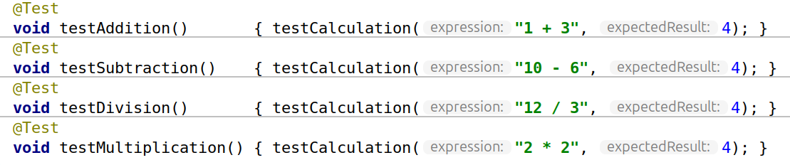
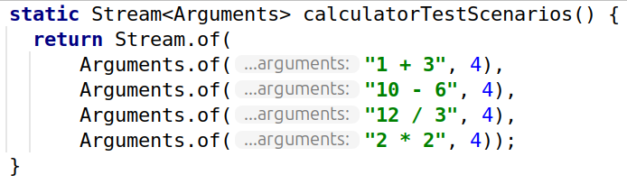
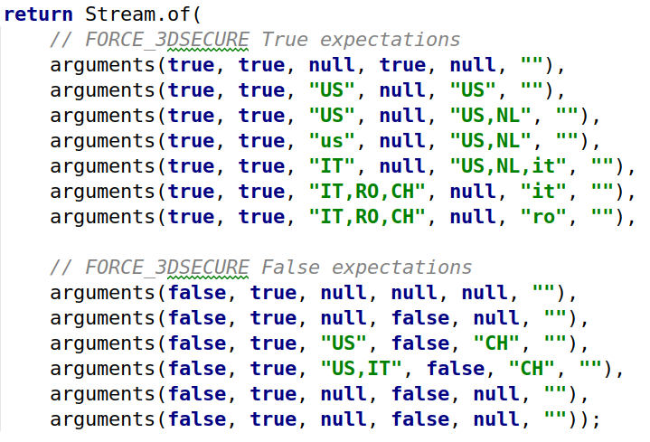
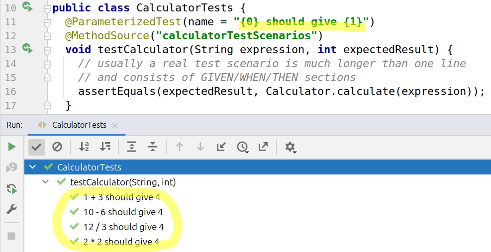

# You might not need parameterized tests

_March 2025_

Let's consider an example of a typical JUnit parameterized test:

```java
public class CalculatorTests {
  @ParameterizedTest(name = "{0} should give {1}")
  @MethodSource("calculatorTestScenarios")
  void testCalculator(String expression, int expectedResult) {
    // usually a real test scenario is much longer than one line
    // and consists of GIVEN/WHEN/THEN sections
    assertEquals(expectedResult, Calculator.calculate(expression));
  }

  static Stream<Arguments> calculatorTestScenarios() {
    return Stream.of(
        Arguments.of("1 + 3",  4), // tests addition
        Arguments.of("10 - 6", 4), // tests subtraction 
        Arguments.of("12 / 3", 4), // tests division
        Arguments.of("2 * 2",  4)  // tests multiplication
    );
  }
}
```
    
for a hypothetical application:
```java
class Calculator {
  public static int calculate(String expression) {
    // actual implementation goes here
    return 4;
  }
}
```

Conceptually the test above is almost identical to writing the tests without parameterization:

```java
public class CalculatorTests {
  void testCalculation(String expression, int expectedResult) {
    // usually a real test scenario is much longer than one line
    // and consists of GIVEN/WHEN/THEN sections
    assertEquals(expectedResult, Calculator.calculate(expression));
  }
  @Test
  void testAddition()       { testCalculation("1 + 3",  4); }
  @Test
  void testSubtraction()    { testCalculation("10 - 6", 4); }
  @Test
  void testDivision()       { testCalculation("12 / 3", 4); }
  @Test
  void testMultiplication() { testCalculation("2 * 2",  4); }
}
```

Surprisingly, the less-clever second variant also has some advantages:

- It's conceptually simpler, less framework magic involved (of JUnit test engine).

- It's less straightforward (although, of course, possible) to run a single test case with parameterized test.
             
- Since you have separate tests you are able to apply meaningful names to each of them. If you go further, you could say of adding javadocs to some/all of them to clarify each test scenario (example: reference to a business requirement, etc.).

- It's more IDE-friendly (therefore, maintainable, comprehensible).

Compare this (notice, how IDE helps with the meaning of arguments):



to this (not much help):



If this is not convincing enough, here is an example from a real project:



☝ Good luck matching to test parameters!

To be fair, there is at least one argument in favor of parameterized tests: you can use test names parameterization to get human-readable names:



However, I think this is only usable if the test has up to a few parameters.

## Conclusion

There is nothing wrong in not using parameterized tests and preferring less-clever ordinary tests approach.

It's also worth mentioning how in other case using the same strategy of preferring "ordinary" tests over "clever" tests [helped to speed up the test suit](optimize_tests.md). 


