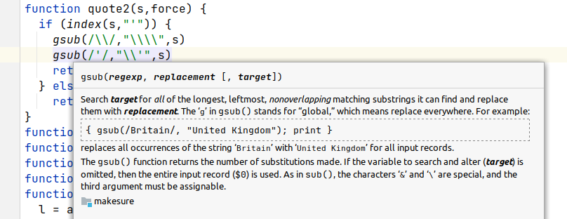
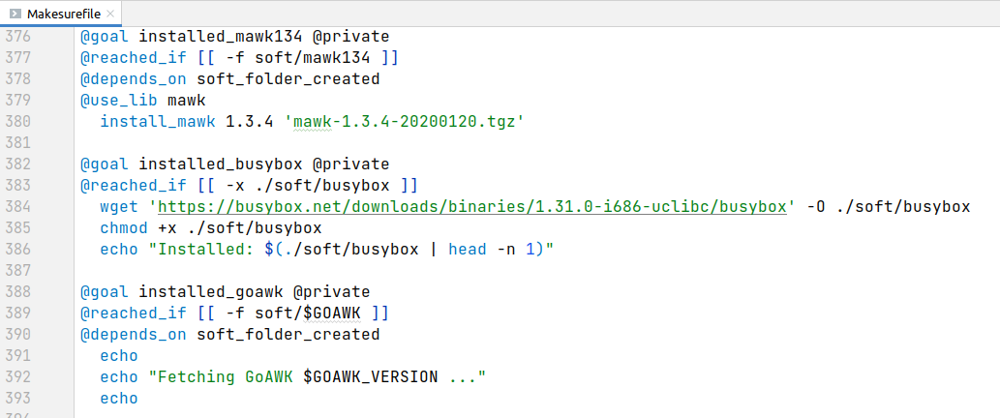

# Adding parameterized goals to makesure

## What is makesure?

[Makesure](https://github.com/xonixx/makesure) is a task/command runner that
I’m developing. It’s sort of similar to the well-known `make` tool, but
[without most of its idiosyncrasies](makesure-vs-make.md) (and with a couple of unique features!).

## The need for parameterized goals

When you write big build files, inevitably you start getting some copy-paste in there. Typical use case: you want to test your code against multiple versions of some software / programming language / compiler.

To illustrate the point let's imagine you wrote a python script and want to make sure it runs correctly with both Python 2 and Python 3 (this example is a bit artificial, but good for explanation).

```shell
@goal pythons_tested
@depends_on python2_tested python3_tested

@goal python2_installed
@depends_on soft_folder_created
@reached_if [[ -x ./soft/python2 ]]
  wget "https://software-repository/python2.tar.gz"
  tar xzvf python2.tar.gz --directory ./soft
  rm python2.tar.gz 
 
@goal python2_tested 
@depends_on python2_installed
  if ./soft/python2 script.py
  then
    echo "SUCCESS"
  else
    echo "FAIL"
    exit 1
  fi

@goal python3_installed
@depends_on soft_folder_created
@reached_if [[ -x ./soft/python3 ]]
  wget "https://software-repository/python3.tar.gz"
  tar xzvf python3.tar.gz --directory ./soft
  rm python3.tar.gz 
 
@goal python3_tested 
@depends_on python3_installed
  if ./soft/python3 script.py
  then
    echo "SUCCESS"
  else
    echo "FAIL"
    exit 1
  fi
  
@goal soft_folder_created
@reached_if [[ -d soft ]]
  mkdir soft
```

I guess you see the issue. 

Parameterized goals to the rescue!

```shell
@goal pythons_tested
@depends_on python_tested @args '2'
@depends_on python_tested @args '3'

@goal python_installed @params VERSION
@depends_on soft_folder_created
@reached_if [[ -x ./soft/python$VERSION ]]
  local tgz="python$VERSION.tar.gz"
  wget "https://software-repository/$tgz"
  tar xzvf "$tgz" --directory ./soft
  rm "$tgz" 
 
@goal python_tested @params VERSION 
@depends_on python_installed @args VERSION
  if ./soft/python$VERSION script.py
  then
    echo "SUCCESS"
  else
    echo "FAIL"
    exit 1
  fi

@goal soft_folder_created
@reached_if [[ -d soft ]]
  mkdir soft
```

Much better!

***

For more realistic example let's consider the build file of my project [intellij-awk](https://github.com/xonixx/intellij-awk) - the missing IntelliJ IDEA language support plugin for AWK. There, [starting line 119](https://github.com/xonixx/intellij-awk/blob/89d7c22572329c9f122550c69b60597bc0f4e9d9/Makesurefile#L119) I had some rather repetitive set of goals. They were responsible for downloading HTML documentation files from [Gawk online manual](https://www.gnu.org/software/gawk/manual/html_node/index.html), processing them and compiling the resulting file [std.awk](https://github.com/xonixx/intellij-awk/blob/main/src/main/resources/std.awk). This file is then used to provide documentation popups inside IDE:



And [this is how the same goals look](https://github.com/xonixx/intellij-awk/blob/cd96a7ec1a10239abe1e7425a43fd16059bcec0a/Makesurefile#L126) after the refactoring them using goal parameterization. 

Pretty impressive, huh? To make it more prominent just check [the diff of the change](https://github.com/xonixx/intellij-awk/compare/89d7c22572329c9f122550c69b60597bc0f4e9d9...cd96a7ec1a10239abe1e7425a43fd16059bcec0a#diff-9366ca676ebdcbca92d07386a93b23f5f7e4afab8edc2f1233f7f4118edd9312R122).

***

I want to mention also the other case for parameterized goals. You see, makesure happened to have very simple yet powerful facility [@reached_if](https://github.com/xonixx/makesure#reached_if). A goal can declare a condition that it has already been reached. In this case, the goal body (the corresponding shell script) will no longer be executed. This simple mechanism makes it very convenient and declarative to express the **idempotent** logic of work. In other words, to speed up the build, since what has already been done will not be repeated. This feature has been inspired by ideas from Ansible.

No wonder people [started using Makesure as very simple Ansible replacement](https://github.com/xonixx/makesure/issues/112). But at that time it lacked parameterized goals, and so again they suffered from [repetitive code with no easy way to reuse](https://github.com/xonixx/makesure/issues/112#issuecomment-1242065047).

***

Next, I want to talk a bit about how I designed this function and what principles I followed.

## Design principles

I design the tool very minimalistic. In accordance with the principle [worse is better](https://en.wikipedia.org/wiki/Worse_is_better) all else being equal I prefer not to add a feature to the project than to add it. In other words, the necessity of a feature must be absolutely outstanding to justify its addition.

*In general, when developing a product or library, it is very important to implement the minimum possible functionality, and exactly the one that users need now. Quite often, developers are tempted to add some obvious improvements and features that are not critical and/or are redundant, simply because it seems simple. Moreover, for the same reason, it is often useful to explicitly exclude certain features/use cases. Because you can always add them later if there is an explicit request from users. Removing some kind of unsuccessful feature can be much more problematic.*

So I used to have [this piece](https://github.com/xonixx/makesure/tree/e54733e43553b3eb656a8b5b03bf6a0be208397f#omitted-features) in documentation.

> **Omitted features**
> - Goals with parameters, like in [just](https://github.com/casey/just#recipe-parameters)
>   - We deliberately don't support this feature. The idea is that the build file should be self-contained, so have all the information to run in it, no external parameters should be required. This should be much easier for the final user to run a build. The other reason is that the idea of goal parameterization doesn't play well with dependencies. The tool however has limited parameterization capabilities via `./makesure -D VAR=value`.

It appears that actually what we didn't want to support was calling goals with arguments from CLI. Thus, this part [was re-worded a bit](https://github.com/xonixx/makesure/tree/b549d2ef575d601de05a9630e527f755a4d83252#omitted-features). 

Parametrized goals themselves appeared to be really needed feature as explained by examples above.

## Design considerations

For a long time I resisted to add the feature. Firstly, due to increasing complexity that will not be needed in a majority of typical `makesure` usage scenarios. But mostly, because it’s tricky to do while preserving the declarative semantics of dependencies. You see, dependency of one goal on another is fundamentally different from function call.

Why is so? You see, the dependency tree is resolved by `makesure` before running the goals! This is why, for example, it is possible to report a cycle in dependencies as an error, rather than falling into an infinite execution loop. Also, the run-only-once semantic for reaching goals: 

```shell
@goal a
@depends_on b c

@goal b
@depends_on c

@goal c
  echo "Reaching c ..." # must be printed only once
```

But this was not impossible. For example, [just](https://github.com/casey/just) does have parameterized goals.

I needed some time to think on the problem in depth. Adding the feature needed lots of thorough consideration to:

- Come up with good syntax: easy to use and easy to parse.
- Accidentally not to introduce alternative ways of doing the same.
- Avoid considerable complication of implementation and adding lots of KB to code size. You see, `makesure` is a tiny one-file script [designed to be zero-install](https://github.com/xonixx/makesure/tree/e54733e43553b3eb656a8b5b03bf6a0be208397f#installation), it must be extremely lightweight.  
- Understand all possible implications of new feature to the existing ones, so make sure they play well in all reasonable combinations.

## Implementation process

Idea of parameterized goals lived for quite some time in my head. The first design attempt was [this](https://github.com/xonixx/makesure/issues/96). But it appeared to be a dead end in this form (simply, I didn't like the result), so it was discarded.

A lot of time has passed. [Russia started aggressive and genocidal full scale war against my country 🇺🇦Ukraine](https://en.wikipedia.org/wiki/2022_Russian_invasion_of_Ukraine). 

I started the new design from drafting the basic design points in the [document](https://github.com/xonixx/makesure/blob/main/docs/parameterized_goals.md). 

Obviously, I started from designing the syntax, and quickly came to the solution with two complementary keywords `@params` and `@args` (this was inspired by `async` + `await` from JavaScript):

```shell
@goal greet @params H W
  echo "$H $W!"
  
@goal default
@depends_on greet @args 'hello' 'world' 
@depends_on greet @args 'hi' 'there' 
```        

I also considered the syntax: 
```shell
@goal greet(H, W)
  echo "$H $W!"
  
@goal default
@depends_on greet('hello', 'world') 
@depends_on greet('hi', 'there') 
```

Despite the latter is more natural for a programmer, I settled on the former for the following reasons:

1. It's much easier to parse. Remember, worse is better.
2. The syntax of `Makesurefile` is designed on purpose to be a valid shell syntax (though, the semantic can differ). This gives a free syntax highlighting in IDEs and [on GitHub](https://github.com/xonixx/makesure/blob/main/Makesurefile). 



[Further](https://github.com/xonixx/makesure/blob/main/docs/parameterized_goals.md#q-default-values), in the same design document I analyzed other aspects of the feature in the form of Q and A. Mostly I strove to answer "No." to most of them in order to keep the feature as limited as possible, but at the same time useful for existing use-cases. If need be, later some or all of them can be added. But it's absolutely important to start from [something really simple but practical](https://world.hey.com/dhh/the-simplest-thing-that-could-possibly-work-8f0d8b43).

***

I used as a playground https://github.com/xonixx/awk_lab/blob/main/parameterized_goals.awk

I want to elaborate a bit about declarative semantics and complexity.

## Result
